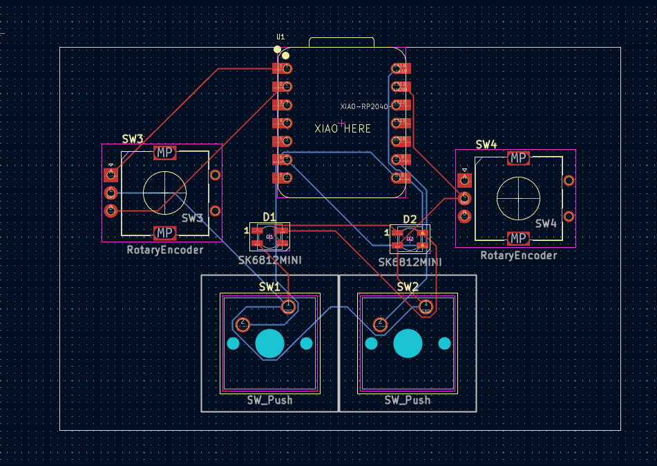

# Toner's Media + Osu Macropad
Here's my submission for my macropad! I created a two-in-one macropad that doubles as a media player, allowing fast forward and rewind as well as volume and brightness adjustments using rotary encoders.

## PCB and Schematic
Here's a picture of my schematic!

Schematic            |  PCB
:-------------------------:|:-------------------------:
  |  

- [x] I ran DRC in KiCad and have made sure there are 0 errors!

## CAD Model:

This was made in fusion 360

## BOM
* 2x Cherry MX Switches
* 2x SK6812 MINI-E LEDS
* 2x EC11 Rotary Encoders
* 1x Seeed XIAO RP2040
* 2x Blank DSA Keycaps (white)
* 4x M3x16 Screws
* 4x M3 Heatset Inserts
* KMK Firmware